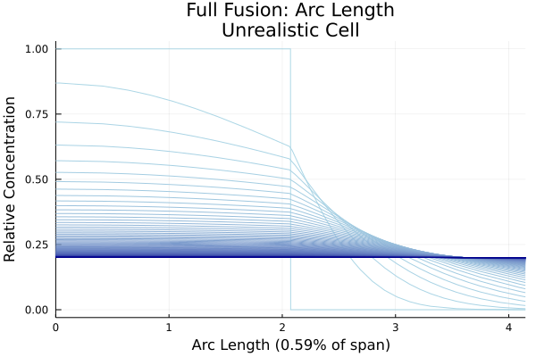

# ProteinDiffusion.jl (WIP)
Modelling the diffusion of proteins on cell membranes for two fusion modes:
* Full Fusion: The vesicle is fully incorporated into the cellular membrane.
* Kiss-and-Run: The vesicle opens a small pore, delivers proteins, then detaches.

This package simulates both scenarios as a concentration level diffusion on the surface of a sphere (full fusion) or connected spheres (kiss-and-run).


## Usage
### Installation
This package is not registered, and thus can only be installed through cloning this repository.

### Loading
After git cloning, run
```julia
using ProteinDiffusion
```

### Running
Define the cell and vesicle
```julia
v = Membrane(1.0, 1.0)
c = Membrane(2.0, 0.2)
```

Run the full fusion model.
```julia
f = FullFusion(v, c)
```

View the diffusion
```julia
plot(f, arc)
```



Run the KNR fusion model.
```julia
Rj = 0.4
k = KNRFusion(v, c, Rj)
```

View the diffusion
```julia
plot(k.arc)
```

The raw output data are stored in `f.raw` and `k.raw`, and can also be plotted as above.

## Model Details
As detailed in the [documentation][doc]:
1. The full fusion and kiss-and-run fusion models consist of diffusion on a sphere and on connected spheres respectively.
2. The weak form is derived for each fusion mode.
3. The weak form for each mode is then fed to the same 1-dimensional finite element method implementation.
4. Due to stiffness, a backward Euler method discretizes the resulting ODE system.
5. The solved dynamics are interpolated into a function.

## Development Roadmap
* Include angular extremeties in grid.
* Derive base timestep.
* Develop tests for known analytic solutions.
* Decrease timestepping (especially for integration, becomes visibly piecewise-linear).
* Reduce computation time for integration.
* Parse for valid inputs.
* Create comparison structure/function.
* Compute fusion spot radius.
* Simulate pixellation.

### Discussion
* TIRF Microscopy method research.
  * Pixel sizes.
  * TIRF zone.
  * Frequency and incident angle of light source.
* Point spread functions.
* Spot radius is the pre-fusion vesicle radius.
* Ring size "same" as spot radius.
* Family of curves.
* Is diffusion slow because of KNR or because of diffusivity?
* Photo taking bleaches the proteins.
  * Lots of early photos.
  * Photos spread out.

## References

[doc]: ./doc/proteindiffusion.pdf