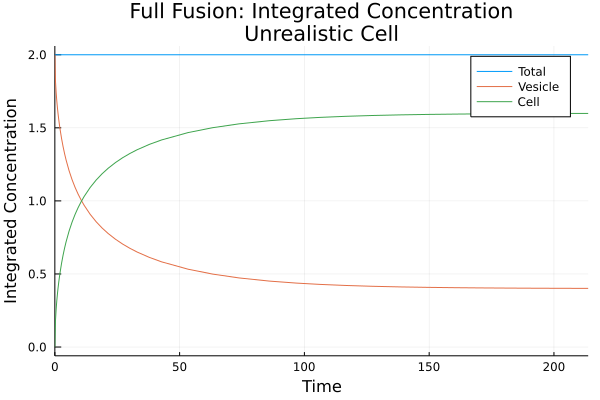
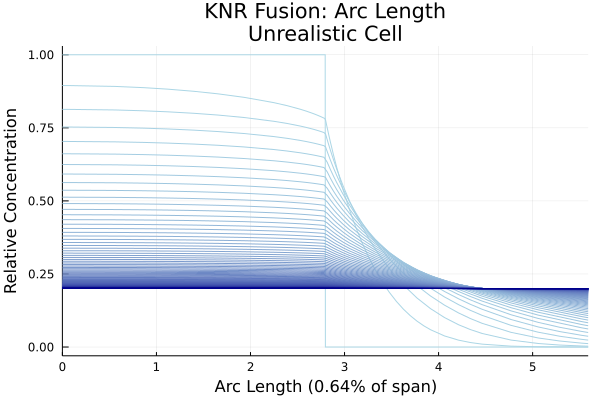
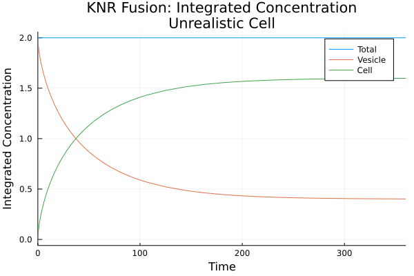

# ProteinDiffusion.jl (WIP)
Modelling the diffusion of proteins on cell membranes for two fusion modes:
* Full Fusion: The vesicle is fully incorporated into the cellular membrane.
* Kiss-and-Run: The vesicle opens a small pore, delivers proteins, then detaches.

This package simulates both scenarios as a concentration level diffusion on the surface of a sphere (full fusion) or connected spheres (kiss-and-run).


## Usage
### Installation
This package is not registered, and thus can only be installed through cloning this repository.

### 
After git cloning, run
```julia
using ProteinDiffusion
```

### Full Fusion
Set the parameters.
```julia
# Radii
Rv = 1.0
Rc = 2.0

# Diffusivity
Dv = 1.0
Dc = 0.2
```

Run the model.
```julia
f = full_fusion(Rv, Rc, Dv, Dc)
```

Plot the concentration WRT arc length.
```julia
using Plots
plot(f.ang, title = "Unrealistic")
```


View the total concentration integral over time.
```julia
using Plots
plot(f.int, title = "Unrealistic")
```



The raw output data is stored in `f.raw` and can also be plotted as above.

### Kiss-and-Run Fusion
Set the parameters.
```julia
# Radii
Rv = 75e-3 # [μm] GLUT4 vesicles
Rc = 17.0 # [μm] adipocytes (smaller of bimodal size distribution)
Rj = Rv/3 # [μm] pore junction radius

# Diffusivity
Dv = 0.5
Dc = 2.0
```

Run the model.
```julia
k = knr_fusion(Rv, Rc, Rj, Dv, Dc)
```

Plot the concentration WRT arc length.
```julia
using Plots
plot(k.arc)
```



View the total concentration integral over time.
```julia
using Plots
plot(k.int)
```



The raw output data is stored in `k.raw` and can also be plotted as above.

## Model Details
As detailed in the [documentation][doc]:
1. The full fusion and kiss-and-run fusion models consist of diffusion on a sphere and on connected spheres respectively.
2. The weak form is derived for each fusion mode.
3. The weak form for each mode is then fed to the same 1-dimensional finite element method implementation.
4. Due to stiffness, a backward Euler method discretizes the resulting ODE system.
5. The solved dynamics are interpolated into a function.

## References

[doc]: ./doc/proteindiffusion.pdf